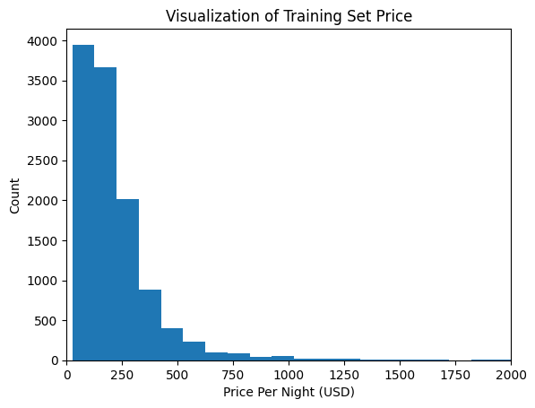

# Airbnb Price Prediction

A machine learning pipeline that predicts daily Airbnb listing prices in Boston using regression techniques and real-world listing data.



---

## 🔍 Overview

This project aims to create a predictive model for Airbnb listing prices using publicly available data from [Inside Airbnb](http://insideairbnb.com/). By automating price prediction based on features such as location, amenities, and property characteristics, hosts can optimize pricing strategies and maximize income. This regression model helps uncover what contributes to higher prices, giving actionable insights to Airbnb hosts.

> This project tackles a real-world problem by applying regression models to scraped Airbnb listing data for Boston, with potential for scaling to other cities or larger datasets.

---

## 🛠️ Tech Stack

- Python  
- Polars  
- Optuna  
- Scikit-learn (patched with `sklearnex`)  
- RandomForestRegressor (used in imputation)  
- IsolationForest (for outlier detection)  
- Matplotlib (for visualization)  
- XGBoost
- Jupyter Notebook

---

## 🚀 Features

- Downloads and processes compressed listing data from Inside Airbnb  
- Cleans and transforms messy real-world data using `polars`  
- Drops redundant columns and handles missing values with `IterativeImputer`  
- Automates outlier removal using `IsolationForest`  
- Tunes hyperparameters using `Optuna`  
- Visualizes price distribution for insights and feature importance  
- Uses ensemble regression models for prediction

---

## 📈 Results

- **Target Variable**: Price per night (USD)
- **Model Used**: XGBoost Regressor
- **Outlier Handling**: Isolation Forest
- **Imputation**: Iterative Imputer with Random Forest
- **Visualization**: Histogram of price distribution
- **Model**: Achieved an RSME of 0.2218 with XGBoost

---

## 🧠 What I Learned

- Gained experience in real-world data preprocessing using `polars`
- Learned to optimize model performance with `Optuna`
- Improved understanding of how to handle missing values using ensemble imputation
- Developed skills in applying unsupervised learning (IsolationForest) to detect outliers
- Practiced interpreting and normalizing skewed distributions in regression modeling

---

## 📦 Installation & Usage

```bash
git clone https://github.com/yourname/airbnb-price-prediction.git
cd airbnb-price-prediction
pip install -r requirements.txt
jupyter notebook final-project-complete.ipynb
